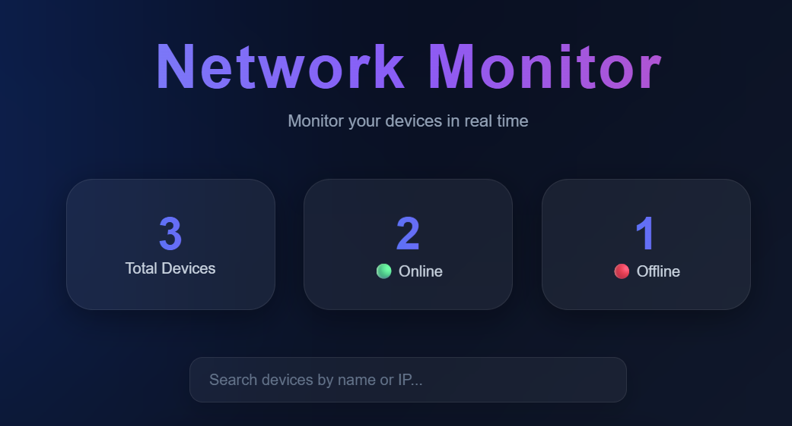
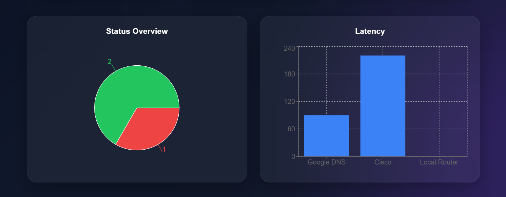
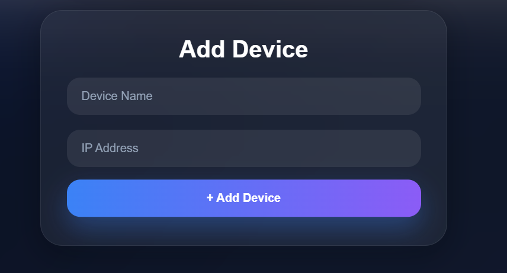
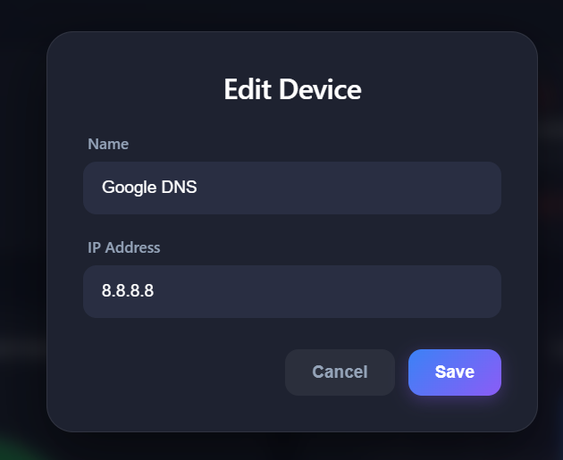

# Network Monitor Dashboard

A full-stack network monitoring solution engineered with React, Express.js, PostgreSQL, Prisma, Socket.IO, and Docker.

This application provides real-time infrastructure monitoring, detecting device connectivity status and latency metrics, wrapped in a modern dashboard interface designed for seamless network asset management.

---

## Core Features

* **Real-Time Monitoring:** Continuous, low-latency device status tracking.
* **Automated Status Detection:** Immediate identification of online and offline states.
* **Latency Measurement:** High-precision latency tracking utilizing ICMP ping protocols.
* **Device Management (CRUD):** Full capabilities to provision, update, and decommission network assets.
* **Advanced Querying:** Fast filtering and searching of devices by hostname, asset name, or IP address.
* **Data Visualization:** Dynamic charts and live statistical widgets for operational insights.
* **Bi-directional Communication:** Real-time data synchronization powered by Socket.IO.
* **Containerized Environment:** Fully dockerized setup ensuring environment consistency across development and production.

---

## Screenshots

<p align="center">
  
  
</p>

<p align="center">
  
  
</p>

---

## Technical Stack

| Layer | Technologies |
| :--- | :--- |
| **Frontend** | React, Vite, Axios, Socket.IO Client, Recharts, CSS3 |
| **Backend** | Node.js, Express.js, Prisma ORM, Socket.IO, Native Ping Utilities |
| **Database** | PostgreSQL |
| **DevOps** | Docker, Docker Compose |

---

## Installation and Deployment

### 1. Clone the Repository

Initialize the local environment by cloning the repository:

```bash
git clone https://github.com/yourusername/network-monitor-dashboard.git
cd network-monitor-dashboard
```

### 2. Orchestration with Docker

Deploy the entire application stack (frontend, backend, and database) using Docker Compose:

```bash
docker compose up --build
```

### Service Architecture URL Mapping

Once the containers are operational, the services are exposed at the following endpoints:

| Service | Endpoint URL | Description |
| --- | --- | --- |
| **Frontend** | `http://localhost:5173` | Client User Interface |
| **Backend API** | `http://localhost:3000` | RESTful API & WebSocket Server |
| **PostgreSQL** | `localhost:5432` | Relational Database Engine |

---

## Database Schema

The relational schema is mapped via Prisma ORM as defined below:

```prisma
model Device {
  id        Int      @id @default(autoincrement())
  name      String
  ip        String
  status    String
  latency   Float?
}
```

---

## Future Roadmap

* [ ] Implementation of time-series databases for historical latency tracking.
* [ ] Group-based asset management and network tagging.
* [ ] Enterprise-grade Authentication and Authorization (RBAC).
* [ ] Automated alerting and notification system (Webhook, Email, Slack).
* [ ] Theme provider implementation (Dark and Light modes).
* [ ] Cloud deployment manifests (Kubernetes / AWS ECS).
* [ ] Responsive UI/UX optimization for mobile viewports.

---

## Author

* **Keyvan Hojabr** — *Full Stack Developer*
* This project was architected as a modern, scalable solution for enterprise network monitoring, leveraging robust backend sub-systems and real-time data streaming.
